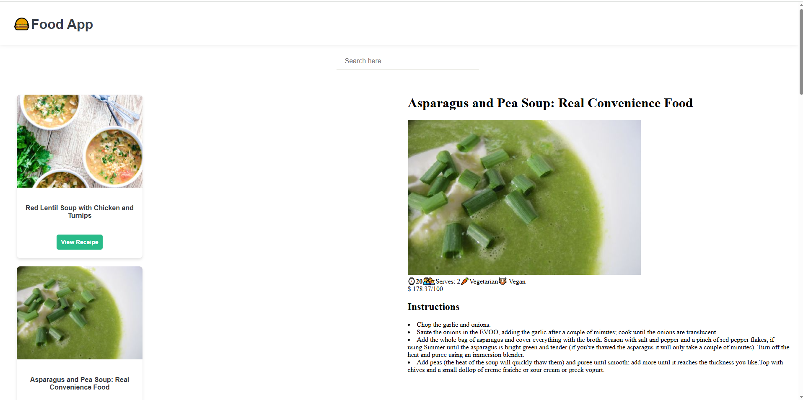
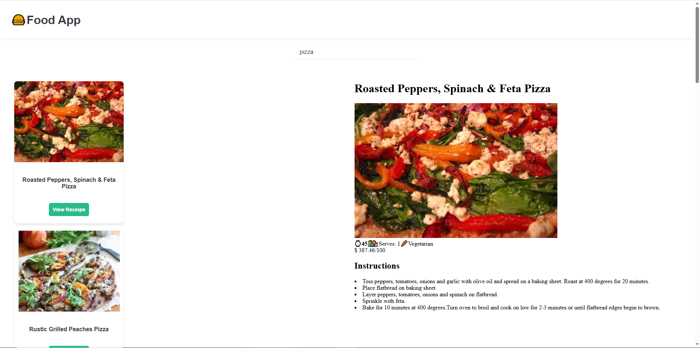

# 🍔 Food Recipe App
A simple React-based Food Recipe application where users can search and view detailed recipes. Built with Vite and styled using modular CSS.

## 📁 Project Structure
FOOD-RECIPE/
│
├── node_modules/
├── public/
├── src/
│ ├── components/
│ │ ├── assets/
│ │ │ ├── Food-Filter.png
│ │ │ └── Food.png
│ │ ├── Container.jsx
│ │ ├── container.module.css
│ │ ├── FoodDetails.jsx
│ │ ├── fooddetails.module.css
│ │ ├── FoodItem.jsx
│ │ ├── fooditem.module.css
│ │ ├── FoodList.jsx
│ │ ├── InnerContainer.jsx
│ │ ├── innercontainer.module.css
│ │ ├── Nav.jsx
│ │ ├── nav.module.css
│ │ ├── Search.jsx
│ │ └── search.module.css
│ ├── App.css
│ ├── App.jsx
│ ├── main.jsx
├── .gitignore
├── eslint.config.js
├── index.html
├── package.json
├── pnpm-lock.yaml
├── vite.config.js
└── README.md

## 🚀 Features

- 🔍 **Search recipes** by name.
- 📋 **List view** of all available recipes.
- 🍽 **Detailed view** of each recipe including ingredients and instructions.
- 🖼️ Modular CSS for component-level styling.

## 📸 Screenshots

### 🧾 Home Page
Displays recipe cards with names, thumbnails, and a button to view the full recipe.

### 🧾 Recipe Details Page
Displays the complete recipe with image, cook time, servings, tags (e.g., vegetarian, vegan), cost, and instructions.

## 🛠️ Installation
# Clone the repository
git clone https://github.com/Web-Dev-Kombee/Food-Receipe.git
cd food-recipe-app

# Install dependencies
pnpm install

# Start the development server
pnpm run dev

🧪 Tech Stack
⚛️ React.js
🛠️ Vite
🧩 CSS Modules
📦 pnpm

📂 Folder Insights
components/: Reusable UI and logic components like NavBar, FoodList, etc.
assets/: Static assets like images.
App.jsx: Main layout and route structure.
main.jsx: App entry point.

✨ Future Enhancements
🍱 Add user login & authentication.
💾 Save favorite recipes.
🌐 External API integration for live recipe data.
📱 Responsive design enhancements.

👩‍💻 Developed By
Khoosbu Patel – Frontend Web Developer
